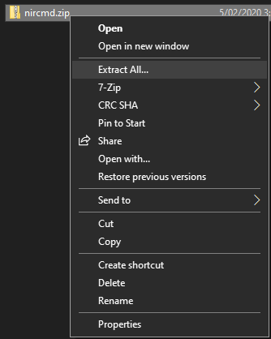
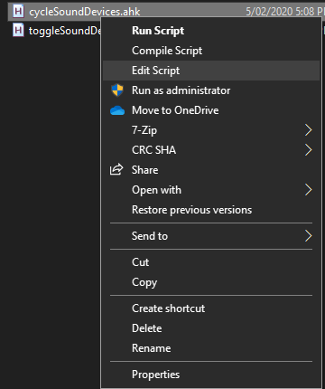
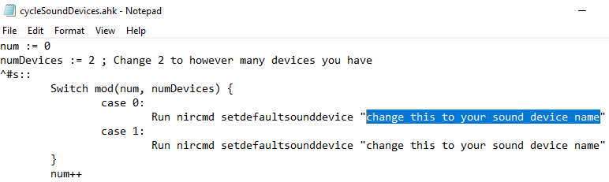
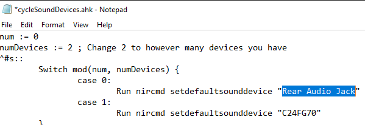
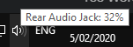
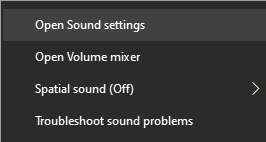
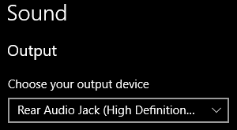
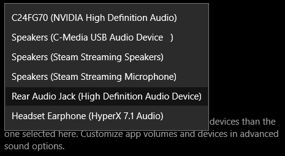
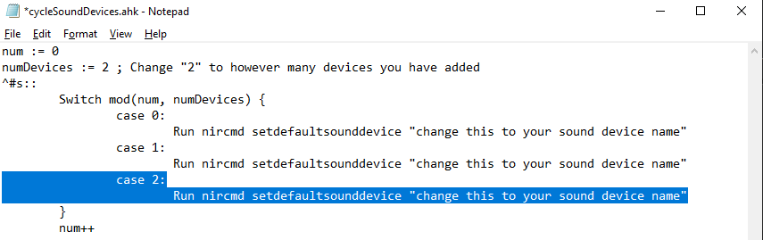
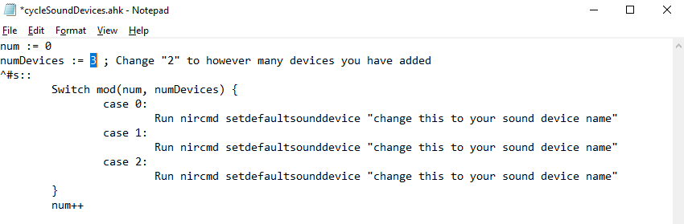

# Default Sound Device Switcher for Windows 10

## What is this?

Included are two AutoHotkey scripts that allow the toggling or cycling between sound devices on Windows 10. 

`cycleSoundDevices.ahk` allows the cycling between however many devices you desire.

`toggleSoundDevices.ahk` allows the toggling between two devices.


## Installation

The scripts are reliant on nircmd [(download)](http://www.nirsoft.net/utils/nircmd.zip) and Autohotkey [(download)](https://www.autohotkey.com/download/ahk-install.exe).

1. Extract `nircmd.zip`



2. Open the `nircmd` folder and copy and paste nircmd.exe into `%windir%\system32`

3. Install Autohotkey
4. Download the [latest release](https://github.com/Toshi-Tabata/switchSoundDevice/releases/latest)

5. Extract the file and open the extracted file

6. Copy and paste **EITHER** `cycleSoundDevices.ahk` or `toggleSoundDevices.ahk` into %appdata%\Microsoft\Windows\Start Menu\Programs\Startup

7. Right click `cycleSoundDevices.ahk` or `toggleSoundDevices.ahk` and click `Edit Script`



8. Inside the script, change the `change this to your sound device name` to your sound device's name (to find the name, see ["Finding Your Sound Device Name"](#FindYourDeviceName) section below)





9. Press `ctrl + s` to save.

10. Double click `cycleSoundDevices.ahk` or `toggleSoundDevices.ahk`


## Finding Your Sound Device Name <a name="FindYourDeviceName"></a>

1. Right click the sound icon



2. Click `open sound settings`



3. Click the drop down menu under `Choose your output device`



4. The name of the device is whatever is written before the brackets `()`. In the above picture, the device name is `Rear Audio Jack`




## Usage

To switch or cycle between sound devices, the default key binding is `ctrl + win + s`.


## Adding More than Two Sound Devices

1. Right click `cycleSoundDevices.ahk` and click `Edit Script`
2. Under `case 1: Run nircmd...` add a new line with 

```
case 2:
	Run nircmd setdefaultsounddevice "change this to your sound device name"
```



3. Repeat step 2 with as many sound devices as desired, each time increasing the number (e.g. adding another sound device, change `case 2` to `case 3` etc.)
4. Change the `change this to your sound device name` to your device's name
5. Change the number in `numDevices := 2` to however many devices you have



- Here, we added 3 devices, so we changed the `2` to `3` 

6. Press `ctrl + s` to save
7. Double click `cycleSoundDevices.ahk` to rerun the script

